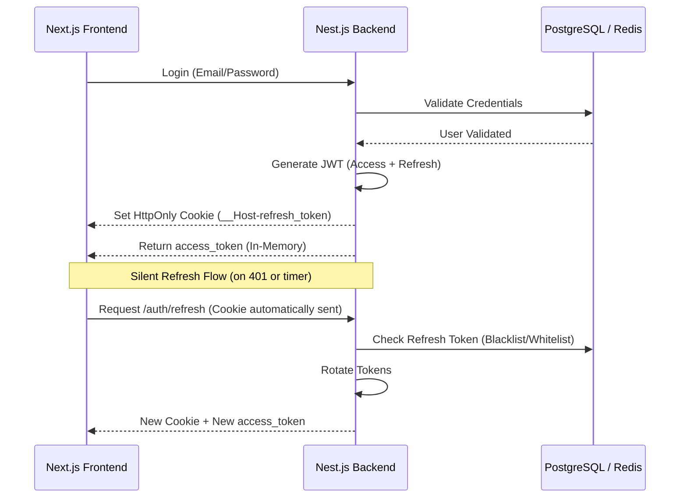

# 🛡️ Secure Auth Lab: The Ultimate Authentication & Exploitation Playground

[](https://nestjs.com/)
[](https://nextjs.org/)
[](https://www.docker.com/)
[](#security-architecture)
[](LICENSE)

> A production-grade laboratory for mastering modern authentication patterns and defending against real-world cyber attacks. Built with **NestJS**, **NextJS**, and **Docker**.

---

## 🚀 Overview
This project is a comprehensive full-stack authentication laboratory. It showcases a hardened security implementation using industry best practices while providing an interactive "Attack Lab" to understand how these defenses can be bypassed—and how to fix them.

### 🛠️ Tech Stack

| Category | Technologies |
| :--- | :--- |
| **Core** | NestJS (v11), NextJS (v15), TypeScript |
| **Security** | Passport.js, JWT (Dual-token), Helmet (CSP), Bcrypt, CryptoJS |
| **Infrastructure** | PostgreSQL (TypeORM), Redis (Caching/Blacklist), Docker Compose |
| **Development** | TDD (Unit/E2E), Monorepo Architecture |

---

## 🔒 Security Architecture

The system implements a **Defense-in-Depth** strategy, ensuring that multiple layers of security protect user data and session integrity.

### 🔄 Authentication Flow
The following diagram illustrates the secure login and silent refresh mechanism:



### 🛡️ Core Security Mechanisms
- **Dual-Token Strategy**: 
    - **Access Token**: Short-lived (1m), stored in-memory on the client to prevent XSS theft.
    - **Refresh Token**: Long-lived (7d), stored in a **HttpOnly, SameSite=Strict** cookie.
- **`__Host-` Cookie Prefix**: Hardens cookies by enforcing `Secure` attribute, path `/`, and preventing subdomain shadowing.
- **Flexible Persistence**: 
    - **Blacklist Strategy**: Uses **Redis** for lightning-fast token revocation.
    - **Whitelist Strategy**: Uses **PostgreSQL** for strict audit-logged sessions.
- **CSP (Content Security Policy)**: Integrated via `helmet` to mitigate XSS and data exfiltration.

---

## 🚩 Attack Lab Showcase

This project includes a dedicated **Attack Lab** with 10 interactive scenarios to test your skills and understand the impact of security misconfigurations.

> [!TIP]
> Visit the [Attack Dashboard](docs/superpowers/sample/attack-dashboard.md) for full instructions and automated exploit scripts.

### ⚔️ Exploitation Highlights

| Scenario | Attack Vector | Security Defense |
| :--- | :--- | :--- |
| **JWT Brute-force** | Cracking weak secrets via `hashcat`. | AES-256 encrypted secrets & complex keys. |
| **XSS Session Hijack** | Stealing sessions via `<script>` injection. | **HttpOnly** cookies & Content Security Policy. |
| **OAuth Shadow** | Intercepting Auth Codes via `redirect_uri`. | **PKCE** & Whitelisted Redirect URIs. |
| **Timing Attack** | Measuring response times for User Enumeration. | Constant-time comparisons & Bcrypt overhead. |

**Attacker Toolkit included:** 
- `jwt_cracker.py`: Automated signature forging.
- `timing_analyzer.py`: Precision response time analysis.
- `leak_listener.py`: Capturing tokens via Referer headers.

---

## 🛠️ Getting Started

### 1. Prerequisites
- Docker & Docker Compose
- Node.js (v20+) & pnpm
- Python 3 (for Attack Lab scripts)

### 2. Quick Start
```bash
# 1. Clone and enter the repo
git clone git@github.com:venhdev/basic-auth-lab.git
cd basic-auth-lab

# 2. Start Infrastructure (Postgres, Redis)
make up

# 3. Setup Environment
cp apps/be/.env.example apps/be/.env
# Update JWT secrets in .env if needed

# 4. Start Applications
# In terminal 1 (Backend)
cd apps/be && pnpm install && pnpm run dev
# In terminal 2 (Frontend)
cd apps/fe && pnpm install && pnpm run dev
```

### 📂 Project Structure
- `apps/be`: NestJS Backend (JWT logic, Strategies, API).
- `apps/fe`: Next.js Frontend (Auth Store, Axios Interceptors, Labs).
- `scripts/exploit`: The Attacker's Toolkit (Python/Bash).
- `docs/`: Technical specifications, design docs, and attack guides.

---

## 📄 License
This project is licensed under the MIT License - see the [LICENSE](LICENSE) file for details.

Built with ❤️ for Security Education.
