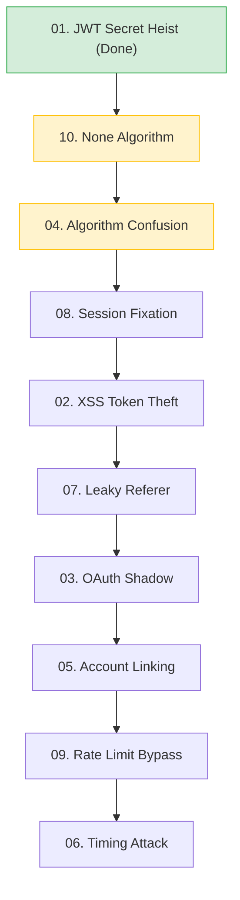

# 🚩 Auth Attack Lab Dashboard

Welcome to the **Red Team Training Ground**. This dashboard is your central hub for exploring and exploiting authentication vulnerabilities in a controlled environment.

## 📈 Lộ trình học đề xuất (Linear Learning Path)

Nếu bạn là người mới, hãy đi theo luồng này để nắm bắt kiến thức từ cơ bản đến chuyên sâu một cách logic nhất:

> [!TIP]
> **Ưu tiên tiếp theo:** Bạn nên thực hiện bài **10** trước khi làm bài **04** để hiểu rõ về sự nguy hiểm của việc Server tin tưởng Header của Client.

## 🛡️ Training Arc

### Phase 1: JWT Exploitation (Tấn công Token)
*Tập trung vào việc bẻ khóa, giả mạo và thao túng các JSON Web Tokens.*
- [x] [01. JWT Secret Heist](./scenarios/01-jwt-brute-force.md) - Brute-force mã bí mật.
- [ ] [04. Algorithm Confusion](./scenarios/04-algorithm-confusion.md) - Đánh lừa thuật toán ký.
- [x] [10. None Algorithm](./scenarios/10-none-algorithm.md) - Vượt qua kiểm tra chữ ký.

### Phase 2: Session & Client-Side (Tấn công Phiên & Trình duyệt)
*Lợi dụng các lỗ hổng phía client để chiếm quyền điều khiển phiên làm việc.*
- [ ] [02. Silent Cookie Miner](./scenarios/02-xss-token-theft.md) - Khai thác XSS & Request Forgery.
- [ ] [07. Leaky Referer](./scenarios/07-leaky-referer.md) - Rò rỉ Token qua Header.
- [ ] [08. Pre-Auth Trap](./scenarios/08-pre-auth-trap.md) - Cố định phiên (Session Fixation).

### Phase 3: OAuth2 & PKCE (Tấn công luồng Ủy quyền)
*Chặn bắt và thao túng các luồng đăng nhập bên thứ ba.*
- [ ] [03. OAuth Shadow](./scenarios/03-oauth-shadow.md) - Đánh chặn Authorization Code.
- [ ] [05. Account Linking Hijack](./scenarios/05-account-linking-hijack.md) - Tấn công liên kết tài khoản.

### Phase 4: Advanced Techniques (Kỹ thuật nâng cao)
*Các phương pháp tinh vi để dò tìm và vượt qua lớp bảo vệ.*
- [ ] [06. Stopwatch Attack](./scenarios/06-timing-attack.md) - Tấn công đo thời gian phản hồi.
- [ ] [09. Zombie Army](./scenarios/09-rate-limit-bypass.md) - Vượt qua chặn IP (Rate Limit).

---

## 🛠️ Tooling Required
- **Python 3**: Chạy các script trong `scripts/exploit/`.
- **Burp Suite Community**: Công cụ chặn bắt và sửa đổi Request.
- **Browser DevTools**: Phân tích Cookie và Network.

> [!IMPORTANT]
> Luôn đảm bảo Backend và Frontend của dự án đang chạy trước khi bắt đầu thực hành.
