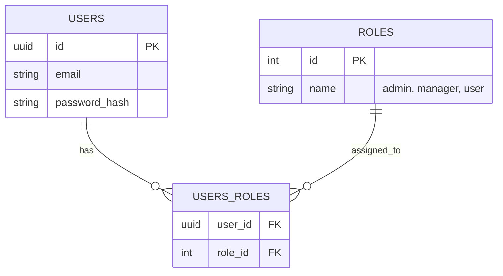

# 🛡️ Comprehensive RBAC & Ownership System Design

## 1. Mục tiêu
Xây dựng hệ thống phân quyền đa vai trò (Multi-roles) và kiểm soát quyền sở hữu (Ownership). Hệ thống hỗ trợ so sánh hai chiến lược xác thực: **Stateless (Vulnerable)** và **Stateful (Secure)** thông qua Feature Flag.

## 2. Mô hình Dữ liệu (Database Schema)

### 2.1. Quan hệ Nhiều-Nhiều (Roles)

### 2.2. Quyền sở hữu (Ownership)
- **Bảng `profiles`**: 
    - `id`: PK
    - `user_id`: FK (Liên kết với `users.id`)
    - `bio`, `avatar_url`, v.v.

## 3. Chiến lược Xác thực (Feature Flag)
Biến môi trường: `RBAC_VERIFICATION_STRATEGY`

| Chiến lược | Mô tả | Tính bảo mật | Lab Scenario |
| :--- | :--- | :--- | :--- |
| **Stateless** | Tin vào `roles[]` và `id` trong JWT payload. | Thấp (Vulnerable) | Algorithm Confusion, JWT Forgery |
| **Stateful** | Truy vấn DB/Redis để lấy Role mới nhất. | Cao (Secure) | Instant Revocation, Defense-in-depth |

## 4. Các lớp bảo vệ (Authorization Guards)

### 4.1. RolesGuard
- **Nhiệm vụ:** Kiểm tra User có sở hữu ít nhất một trong các Role yêu cầu.
- **Logic:**
    - Nếu `Stateless`: `user.roles.includes(requiredRole)`
    - Nếu `Stateful`: `db.findRolesByUserId(user.id).includes(requiredRole)`

### 4.2. OwnershipGuard
- **Nhiệm vụ:** Ngăn chặn tấn công IDOR.
- **Logic:** `request.user.id === resource.ownerId`.
- **Mục tiêu Lab:** Cố tình để trống Guard này ở một số API để thực hành IDOR.

## 5. Chức năng & API

### 5.1. Admin Dashboard (`@Roles('admin')`)
- `GET /admin/users`: Xem danh sách tất cả người dùng và vai trò.
*   `PATCH /admin/users/:id/roles`: Cập nhật danh sách vai trò cho người dùng.
- `POST /products`, `PATCH /products/:id`, `DELETE /products/:id`: CRUD sản phẩm.

### 5.2. User Profile (`@UseGuards(OwnershipGuard)`)
- `GET /profile/me`: Xem profile của chính mình.
- `PATCH /profile/:userId`: Cập nhật profile (Mục tiêu tấn công IDOR).

## 6. Kế hoạch Lab
1. **Lab 05:** Tấn công leo thang đặc quyền (Stateless Mode).
2. **Lab 06:** Tấn công IDOR chiếm đoạt Profile.
3. **Lab 07:** Thử nghiệm Thu hồi quyền tức thì (Stateful Mode).
